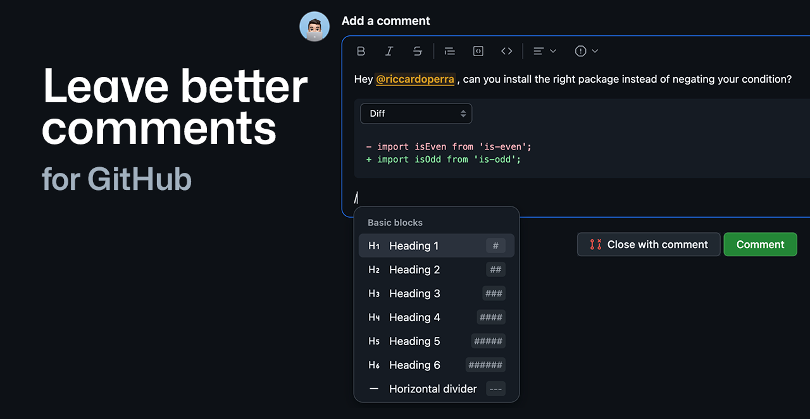

<h1 align="center">
    GitHub Leave Better Comments
</h1>

Ever wasted time to write a decent review, a comment in an issue, or a discussion?
 Maybe the GitHub editor could be improved.

An extension that completely replaces the GitHub native editor,  with a new block-based with a real-time preview experience. 

---

> [!IMPORTANT]
>
> This project is not affiliated with GitHub, Inc. in any way. It is an open source project that just aims to
> improve commenting on GitHub.
> Some data is retrieved via http calls, but no http calls are made using personal data or anything else.

## Install

<a href="">
    
 Install on Chrome and other chromium browsers

</a>

<a href="">
    
 Install on Firefox

</a>

<a href="">
    
 Install on Safari (Mac, iOS and iPadOS)

</a>

## Features

### Support GitHub Flavored Markdown

The extension will add support to live editing with support
for [GitHub Flavored Markdown](https://github.github.com/gfm/).

### Slash Command

You can now use the slash command `/` to toggle a slash command

### More keymaps

Editor will support enhanced keymaps to add blocks with more ease.

### Code block editor

Thanks to WYSYWIG editor, you can now edit code blocks with ease with a custom code block with syntax highlighting (via
shiki).

### User mentions

You can mention users in comments with `@` and the extension will suggest users to mention.

### Issue references

You can reference issues in comments with `#` and the extension will suggest issues to reference

## Stack

This project is built with the following technologies:

- [WXT Extension Framework](https://github.com/wxt-dev/wxt)

#### Editor

- [ProseMirror](https://prosemirror.net/)
- [prosekit](https://github.com/prosekit/prosekit)
- [unified](https://github.com/unifiedjs/unified)

#### UI

- [SolidJS](https://github.com/solidjs/solid)
- [Kobalte](https://kobalte.dev)
