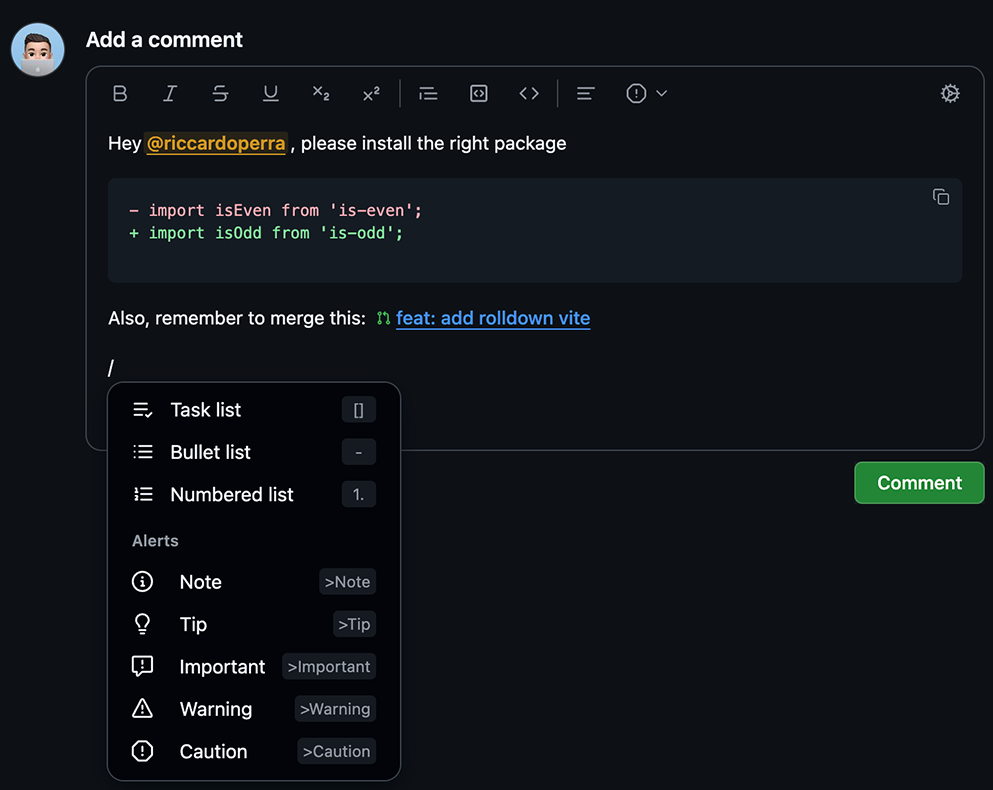

    

<h1 align="center">
    Better comments for GitHub
</h1>

  <i>Ever spent too much time writing a decent review, issue comment, or discussion?
   What if the GitHub comment box could work better?</i> 👀 

An extension that <strong>completely replaces</strong> the GitHub native comment box,  
to a new <strong>block-based</strong> editor and a seamless real-time preview experience. 

> [!IMPORTANT]
>
> This extension is still in development. As always, feedback in this phase is very important, so please open an issue
> if you find any bug or have any suggestion.
>
> ---
>
> This project is not affiliated with GitHub, Inc. in any way. It is an independent project that I initially created for
> myself that aims to enhance the GitHub user experience by providing a better comment editor.

## Install

This extension can be installed via official web store or manually, via the artifacts published in the release page.
Consider that installing via web store is the recommended way, as it will automatically update the extension when a new
version is released.

> [!NOTE]
>
> Since publishing extensions on the web store requires approval, the latest version on the web store may mismatch the
> latest version on the GitHub repository.

[link-chrome]: https://chrome.google.com/webstore/detail/better-comments-for-githu/hkpjbleacapfcfeneimhmcipjkfbgdpg 'Version published on Chrome Web Store'

[][link-chrome] [][link-chrome]
and other Chromium browsers

Install (or update) manually:

- Download the [latest release](https://github.com/riccardoperra/better-comments-for-github/releases/latest) or
  any [other version](https://github.com/riccardoperra/better-comments-for-github/releases) from the release page
- Load the unpacked extension in your browser:
    - In **chrome**, go to `chrome://extensions`, then drag the zip into the page or just click on "Load unpacked" and
      select the zip file.
    - In **firefox**, go to `about:debugging#/runtime/this-firefox`, then click on "Load Temporary Add-on" and select the
      firefox zip file.

## Project structure

The project structure is organized in a monorepo using pnpm workspaces. The structure is still WIP and doesn't 
respect yet the best practices (root folder is a package itself too), but it will be improved in the future.

- **brand**: contains the branding assets, such as logos, promotional assets published in web store.
- **markdown-schema**: a package that contains the markdown proseMirror nodes used by the editor.
- **markdown-transformer**: a package that contains the logic to transform the markdown schema into ProseMirror and vice
  versa.
- **extension**: the browser extension package, responsible to load the editor in the GitHub pages.
- **src**: the core of the editor

## Stack

Built with the following `core` technologies:

- [WXT Extension Framework](https://github.com/wxt-dev/wxt)

#### Editor

- [ProseMirror](https://prosemirror.net/)
- [prosekit](https://github.com/prosekit/prosekit)
- [unified](https://github.com/unifiedjs/unified)

Some of my core own libraries:

- [statebuilder](https://github.com/riccardoperra/statebuilder)
- [prosemirror-processor](https://github.com/riccardoperra/prosemirror-processor)

#### UI

- [SolidJS](https://github.com/solidjs/solid)
- [Kobalte](https://kobalte.dev)
- GitHub Primer CSS variables

## Running the project

- Install the dependencies via `pnpm install`
- Build core libs via `pnpm build:core-libs` (or build them individually)
- Run the extension via `pnpm run dev:extension`

## Features mapping

> [!CAUTION]
>
> Work in progress

### Basic formatting syntax

| Feature                             | Status | Notes                                |
|-------------------------------------|--------|--------------------------------------|
| Headings                            | ✅      |                                      |
| Bold                                | ✅      |                                      |
| Italic                              | ✅      |                                      |
| Strikethrough                       | ✅      |                                      |
| Bold and nested italic              | ✅      |                                      |
| Subscript                           | ✅      |                                      |
| Superscript                         | ✅      |                                      |
| Underline                           | ✅      |                                      |
| Quoting text                        | ✅      |                                      |
| Quoting code                        | ✅      |                                      |
| Color models                        | ❌️     |                                      |
| Links                               | ✅      |                                      |
| Autolink for valid url              | ✅️     |                                      |
| Section links                       | ❌️     | I don't think this will be supported |
| Relative links                      | ❌️     |                                      |
| Custom anchors                      | ❌️     |                                      |
| Line breaks                         | ✅️     |                                      |
| Images                              | ✅️     |                                      |
| Lists                               | ✅️     |                                      |
| Nested lists                        | ✅️     |                                      |
| Task lists                          | ✅️     |                                      |
| Mentioning                          | ✅️     |                                      |
| References issues and pull requests | ⚠️     | Still some issues or missing, WIP    |
| Referencing external resources      | ❌️     |                                      |
| Uploading assets                    | ✅️     |                                      |
| Emoji                               | ✅      | Custom emoji currently not supported |
| Paragraphs                          | ✅️     |                                      |
| Footnotes                           | ❌️     |                                      |
| Alerts                              | ✅️     |                                      |
| Hiding content with comments        | ✅️     |                                      |

### Advanced formatting

| Feature                 | Status | Notes |
|-------------------------|--------|-------|
| Table                   | ✅️     |       |
| Collapsed section       | ✅️     |       |
| Code blocks             | ✅️     |       |
| Diagrams                | ❌️     |       |
| Auto linked references  | ⚠️     |       |
| Attach files            | ✅️     |       |
| Permanent links to code | ❌️     |       |
| Saved replies           | ❌️     |       |

